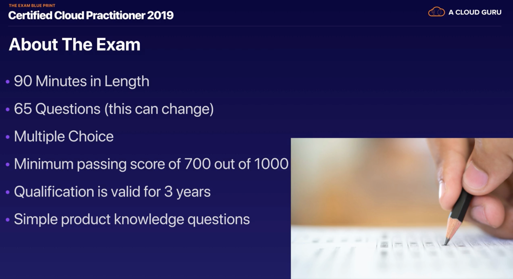

# 0.1 - Exam Blue Print

The exam for AWS Cloud Practitioner consists of 4 sections, which are each independently weighted. Those sections are:
* Cloud Concepts - 28%
* Security - 24%
* Technology - 36%
* Billing and Pricing - 12%

This course will largely be hands on, as that's the best way to learn these things. However, a major exception is the billing and pricing sub section, which will require some powerpoint time.

## Exam details

You can find these online, innit. But about 100 USD and 90 minutes. There are also a series of whitepapers which are worth reading. The most important ones are:

* [Architecting for the Cloud: AWS Best Practices](https://d1.awsstatic.com/whitepapers/AWS_Cloud_Best_Practices.pdf)
* [How AWS Pricing Works](https://d1.awsstatic.com/whitepapers/aws_pricing_overview.pdf)

Read these. They're both vital to the exam and pretty f***ing interesting.

Finally, there's an actual exam blueprint. The latest link is available at [AWS Certified Cloud Practitioner Exam](https://aws.amazon.com/certification/certified-cloud-practitioner/). This document gives you the basics of the test. As of the time of writing, you'll need at least a score of 700, on a scale from 100 to 1000.

Final point, the qualification is valid for a limited time period, currently **3 years**.