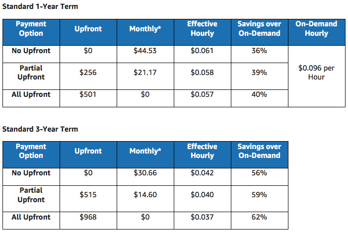

# 2.11 - How AWS Pricing Works - Optimizing Costs with Reservations

While the cloud is well suited to variable workloads and on-demand, rapid deployment, many applications have more predictable patterns. In these cases, organisations can get significant cost savings by using Reserved Instances (RIs) for compute and data services to obtain much lower hourly rates, in exchange for a committment to particular usage parameters.

Most reservations can be made with one of 3 payment terms:
* No Upfront
* Partial Upfront
* Total Upfront

In general, the more you pay upfront, the larger your discount will be.

There are a number of services that you can reserve. We'll now look at several of them

## EC2 Reserved Instances

With EC2, you can reserve compute capacity with a specific configuration. For the duration of your contract, when you spin up an instance with the same configuration as your reservation, AWS will automatically apply the usage price that's associated with your capacity reservation.

### Reserved Instance Marketplace

This marketplace allows AWS customers to list their reserved instances for sale. 3rd party reserved instances are usually listed at lower prices for shorter terms. However, they are no different to reserved intances purchased directly from AWS.

### Amazon EC2 savings with Reserved Instances

To demonstrate the potential savings on offer by reserving an instance, AWS has provided the table below. It lays out the potential savings for an EC2 reserved instance for a standard 1 and 3 year term running a single m5.large Linux instance in US East (N.Virginia) Region.

The key takeaways are that over a 1 year term, will save you 40% over On-Demand pricing. For a 3 year terms, the savings can increase to 62%

## DynamoDB Reserved Capacity

In a similar way to EC2, with DynamoDB you can commit to a specific minimum usage level at a reduced hourly rate over the course of your Reserved Capacity term. Any throughput in excess of your reserved capacity is paid at standard rates.

With a DynamoDB reservation, you would make a one-time upfront fee.

## ElastiCache Reserved Nodes

Here, you can make a one-time payment for each cache node you which to reserve in exchange for a reduced hourly rate.

Elasticache provides 3 Reserved Node types (Light, Medium and Heavy Utilization Reserved Nodes).

## RDS Reserved Instances

As with EC2, you can purchase EC2s using No Upfront, Partial Upfront or All Upfront terms. All RI types are available for Aurora, MySQL, MariaDB, PostgreSQL, Oracle and SQL Server DB engines.

## Redshift Reserved Nodes

Also offer 1-3 year terms, which are suitable if you intend to keep a RedShift cluster running continuously for a prolonged period.