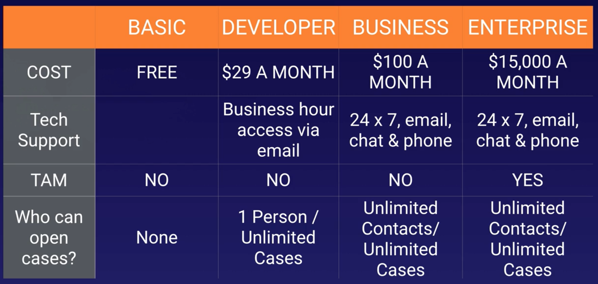
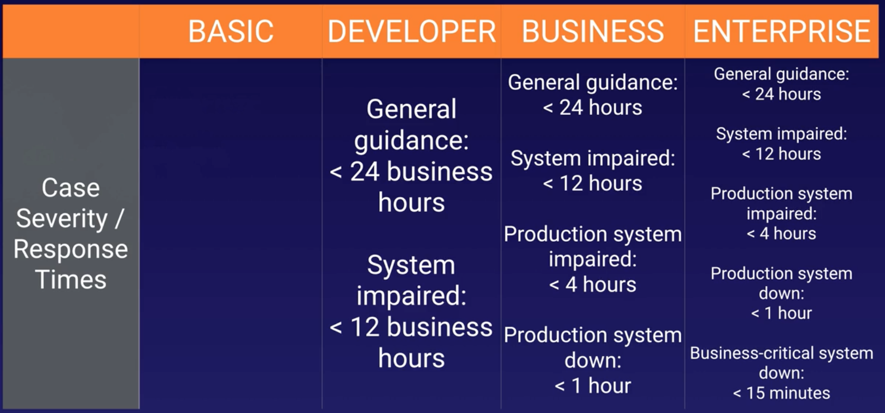

# 2.12 - AWS Support Plans

In this very quick lecture, we'l just review the 4 AWS support plans, which get specifically called out in the AWS exam blueprint.

The tables below summarises the main points.

Additional points to note: 
* The business account prices scale with usage, so can be more than $100