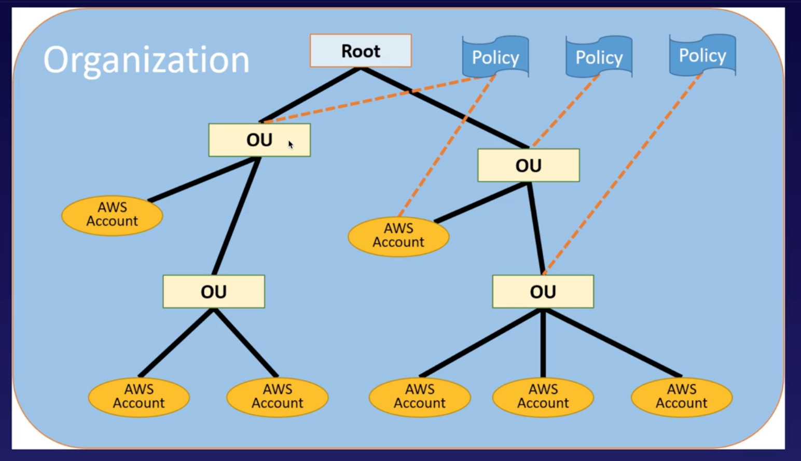
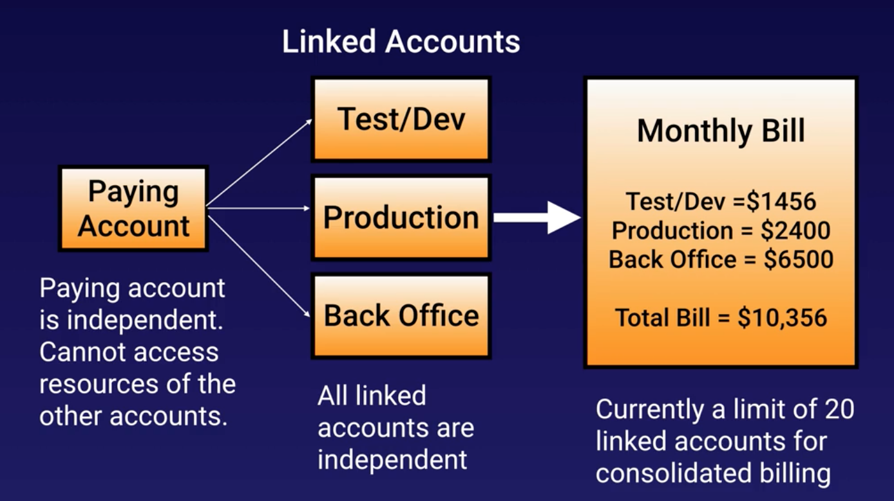

# 2.14 - AWS Organizations and Consolidated Billing

**AWS Organizations** is an account management service that enables you to consolidate multiple AWS accounts into an organization that you create and centrally manage.

Examples of situations where you might have multiple AWS accounts in a single organization would include:
* Seperate accounts for Dev and Prod
* Individual developer accounts for educational purposes
* Seperate accounts for different departments

It's available in two feature sets:
* **Consolidated billing**
* **All features**

Note that for both sets, when monitoring is enabled on the paying account, the billing data for all linked accounts is included. However, you can still create billing alerts per individual account

## All features

An example of an organizations chart is shown below. In it, OU stands for Operational Unit (e.g. the divisions named above). You can see that we can apply policies to both individual accounts, and to organizational units, which in turn filter them down to the accounts they encapsulate.

One of the benefits of organizations is that they allow you to leverage economies of scale in your pricing more easily.

## Consolidated Billing

It's also possible to turn on organizations and only have consolidated billing. The organization diagram for that would look more like this:

There is a soft limit of 20 linked accounts, but this can be changed.

The main advantages of consolidated billing are:
* One bill per AWS account
* Very easy to track and allocate costs
* Volume pricing discount (e.g. on S3 rates for storage per GB)
* Unused reserved instances for EC2 are applied across the group

## Intro to CloudTrail

A minor aside now to briefly introduce CloudTrail, which we need to know about to understand all the recommended best practices for organizations. For this purpose, let's compare it with CloudWatch.

CloudWatch **monitors performance**. We used it early on in our course to set some billing alarms.

CloudTrail **monitors API calls in the AWS platform**. It basically tracks all changes to your AWS account (new resources, new users etc.). It's basically used for auditing. In addition, we should note:
* It is a **per AWS account** service, and is enabled **per region**
* You can **store logs**.

These two features mean that when using CloudTrail with an AWS organization, you can actually consolidate the logs for all your accounts into a single S3 bucket. To do this:
1. Turn on CloudTrail in the paying account
2. Create a bucket policy that allows cross-account access.
3. Turn on CloudTrail in the other accounts and use the bucket in the paying account.

## Best Practices With AWS Organizations

We finish with the best practices for AWS organizations.

* Always enable multi-factor authentication on the root account
* Always use a strong and complex password on the root account
* Paying account should be used for **billing purposes only**. Do not deploy resources into the paying account.
* **Consolidate your CloudWatch logs** into the billing account as described above.