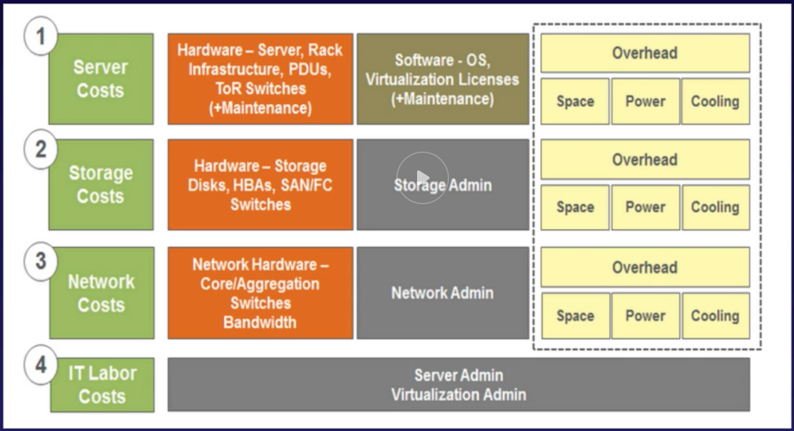

# 2.16 - AWS Calculators

AWS helps you to calculate your costs by using a couple of different calculators, which we'll explore in this lecture. This is a very important part of the Certified Cloud Practitioner Exam, so make sure to give it the time it needs.

Calculators come in 2 feature sets: 
* **AWS Simple Monthly Calculator** - A static website on S3. The simple monthly calculator lets you define your environment, and will then go through and estimate the costs of all the items you've specified. In short:
  > *AWS Simple Monthly Calculator is used to calculate your running costs on AWS on a per month basis. It is not a comparison tool.*
* **AWS Total Cost of Ownership Calculator** - This calculator is designed to help estimate the cost savings of moving to AWS from your existing infrastructure solution. In addition to providing cost estimates, it also provides extra features like reports that can be used in business presentations. IN short:
  > *AWS TCO calculator is used to compare the costs of running your infrastructure on premise vs in the AWS Cloud. It will generate reports that you can give to your C-lever execs to make a business case to move to the cloud.*
  
  Under the hood, this calculator works by breaking the costs down into 4 components, as the diagram below illustrates: 