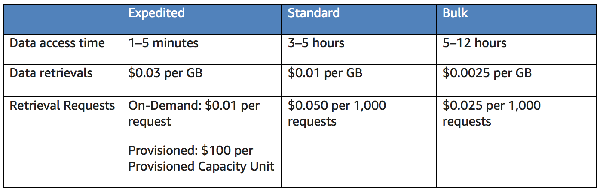

# 2.6 - How AWS Pricing Works - AWS S3 Pricing

S3 is AWS's object-based storage system. For more detail, see the previous section of notes.

## Pricing Details

With S3, you pay only for the storage you use. There is no minimum fee. Prices are based on the location of your S3 bucket. Factors to consider include:
* **Storage class** - S3 comes in 6 classes, Standard, Standard - Infrequent Access (SIA), Standard - One Zone, Intelligent Tiering, Glaciar and Glaciar Deep Archive. The details of individual instance types is discussed in section 1 of these notes. Suffice to say, the tier you choose affects pricing.

* **Storage** - The size and number of object you store affect price, as does the type of storage
* **Requests** - The number and type of requests affect pricing. GET requests incur different costs to others (e.g. PUT).
* **Data Transfer** - The amount of data transferred out of an S3 region affects pricing.

## Glacier

Glacier (and Glacier Deep Archive) are special classes of S3 storage intended for extremely low cost data archiving and long-term backup. As such, all the factors previously mentioned (storage, requests and data transfer) also affect Glacier.

However, it has one additional factor to consider; Glacier pricing varies depending on the **retrieval time of the archived data**. According to this edition of the whitepaper (31st Jan 2018), there are 3 classes, expedited, standard and bulk. The table below summarises the differences between them.

A couple of additional things to bear in mind:

* **Storage and bandwidth includes all file overheads** - Rate tiers take into account your aggregate usage for Data Transfer Out across a wide range (EC2, S3, Glacier, RDS, SimpleDB, SQS, SNS, DynamoDB & Storage Gateway) of AWS services.
* **Glacier Select** - Glacier select is a service that allows queries to run on data stored in Glacier without having to retrieve the entire archive. Pricing for this is determined by:
  * The total amount of data scanned
  * The amount of data returned
  * The number of requests initiated.