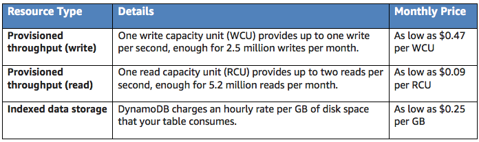

# 2.9 - How AWS Pricing Works - DynamoDB Pricing

DynamoDB is AWS's NoSQL database offering. It's pricing model works a little differently to traditional NoSQL database offerings.

With a traditional NoSQL deployment, you'd be required to think about the memory, CPU, and other system resources that could affect the throughput of your system. With AWS, this stuff matters considerably less. Instead, you'll be asked to define a few things:
* **Target Utilization Rate** - this is the percentage of your total provisioned throughput you want your system to be consuming at any one time.
* **Minimum and Maximum provisioned capacity** - The minimum and maximum throughput capacity you want to be able to provision.

With these two figures defined, DynamoDB automatically handles the provisioning of resources up and down to ensure that your system achieves its target utilization, and can then scale its capacity depending on usage.

Optionally it is also possible to directly specify read ad write capacity if you'd prefer to manually manage table throughput.

There is **no minimum fee** to use DynamoDB.

The table below summarises key pricing concepts in DynamoDB:

## Indexed Data Storage

DynamoDB is an SSD-backed indexed datastore. Because of the memory overhead of indexing, the amount of disk space that your data consumes will be greater than the raw size of the data that you've uploaded.

In DynamoDB, you don't need to "provision" storage. Instead, you're simply charged for what you use, i.e. the raw byte size of your uploaded data plus a per-item storage overhead of 100 bytes to account for indexing.

## Data Transfer

There's no cost for transferring data between DynamoDB and other AWS services in the same region. Data transferred across regions will be charged on both sides of the transfer.

## Global Tables

Global tables in DynamoDB are essentially fully managed, multiregion, multimaster databases that provide fast local read and write performance for massively scaled, global applications. When setting up a global table, you have the capability to replicate your tables across your choice of AWS region.

The pricing for global tables is calculated based on the resources associated with each replica table. Write capacity for global tables is represented by replicated write capacity units (rWCUs) as opposed to standard write capacity units (WCUs).