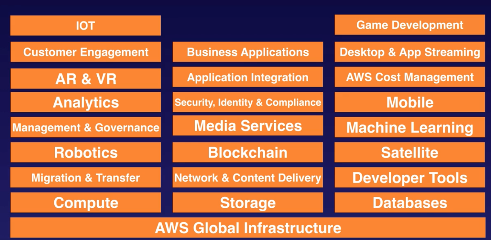
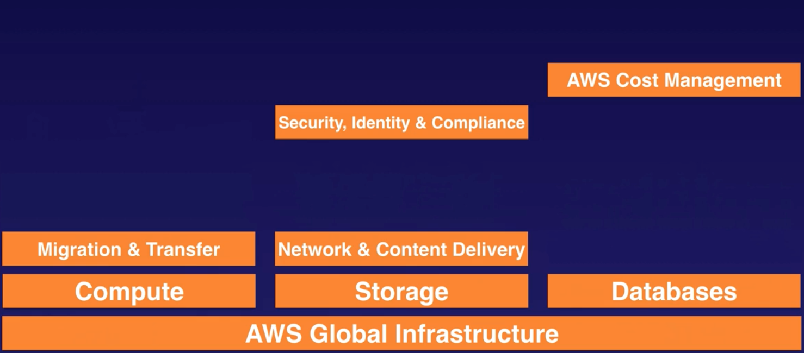
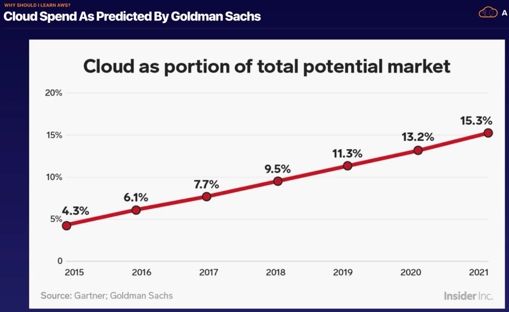
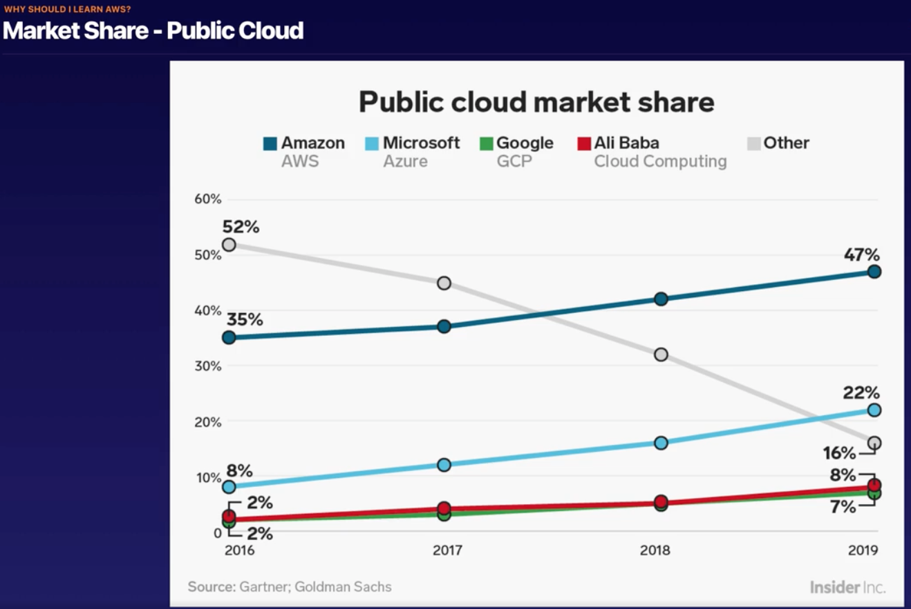

# Cloud Computing and AWS

Welcome to Section 2! In this lecture, we'll be looking at cloud computing and AWS. Specifically, we'll explore at a high level the 6 advantages of cloud computing, the 3 kinds of cloud computing, and the 3 deploy types of cloud computing

## What is Cloud Computing?

Cloud computing is essentially on demand computing resources. Whether that be computing power, database storage, applications, or other it resources, as long as they're available over a network, on-demand, they're cloud computing. Think of it as renting someone else's computer.

## 6 Advantages of Cloud Computing

These are covered in the [Overview of Amazon Web Services](https://d0.awsstatic.com/whitepapers/aws-overview.pdf) whitepaper. Give it a read for more info.

1. **Trade capital expense for variable expense** - Pay as you go rather than a heavy initial investment. A much more efficient pricing scheme.
2. **Benefit from massive economies of scale** - Amazon will always have more purchasing power than you. Leverage their expertise
3. **Stop guessing about capacity** - It's always going to take you time to work out how much you'll need to spend. Cloud removes this uncertainty, and lets your stack scale with your business needs, without needing a long term contract. #autoScaling
4. **Increase speed and agility** - The ability to have all the resources you'll need on demand makes it much easier for you to spin up whatever system it is you want to make. You can move a hell of a lot faster without having to sacrifice anything. Special shout out to serverless here, that particular architecture pattern can make your life a loooot easier.
5. **Stop spending money running and maintaining data centers** - Whatever your business is good at, this isn't it. Let the pros handle it, and focus on what it is that makes you money.
6. **Go global in minutes** - Easily deploy your application worldwide in just a few clicks. That means lower latency, which means better UX, which means $$.

## 3 Types of Cloud Computing

1. **Infrastructure as a Service (IAAS)**

   You manage the server, which can be physical or virtual, as well as the OS. Your data center provider won't normally have access to your server. EC2 instances are a good example of this.
   
2. **Platform as a Service (PAAS)**

    Someone else manages the underlying hardware and operating systems. You just focus on the applications. Someone else handles security patching, maintenance, updates and the like. GoDaddy, as well as Amazon Elastic Beanstalk are examples.
    
3. **Software as a Service (SAAS)**

    Think of Gmail. All you worry about is the software that has been provided to you, and everything else is handled by the company providing the software to you.
    
## 3 Types of Cloud Computing Deployments

1. **Public clouds** - Think of the big three here. AWS, Azure, and GCP
2. **Hybrid** - A mixture of public and private
3. **Private Cloud (or on Premises)** - You manage it in your own data center. Openstack and VMWare are examples of deployment technologies in this.

## AWS High Level Services

AWS do a lot. Don't worry, you don't need to know all of these to pass the exam.

These are only the high level types of services. Under any one of these headings there might be multiple kinds of service. The ones that we need to know something about for the exam are below.

Note that we most certainly don't need to know these in much depth. We'll be looking at all of these in this course.

## What will we learn in this course?

The headings for our course will be:

* Compute
  * EC2
  * Lambda
* Databases
  * Relational Database Service (RDS)
  * DynamoDB (Non Relational Databases)
* Storage
  * Simple Storage Service
  * Glacier
* Network
  * VPC
  * Route53

## Fun Facts

