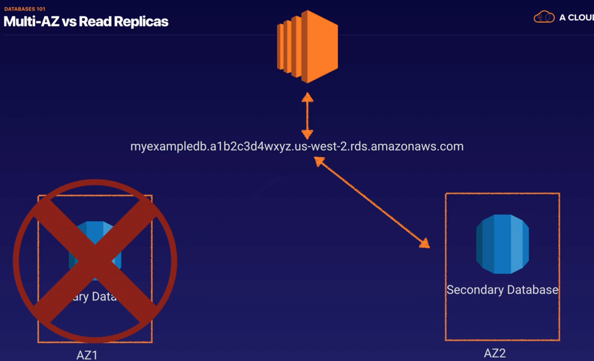
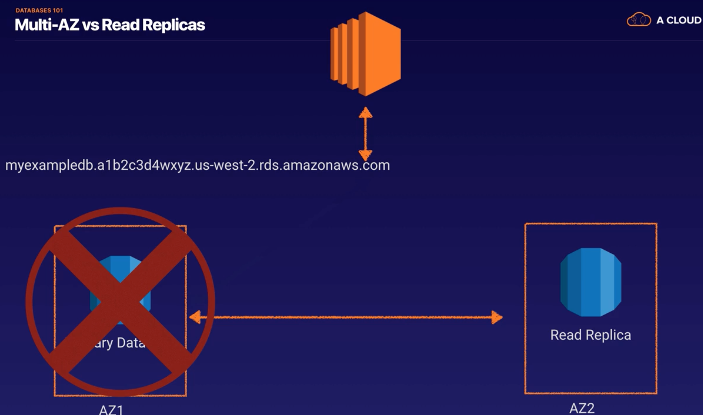

## 1.10 - Databases 101

In this note, we'll introduce databases writ large. Given I'm an actual programmer, we probably won't labor these points too much here.

## Relational Databases (SQL/OLTP)

Relational databases are your classic SQL databases. They've been around since the 70s, and are very loosly analogous to spreadsheets.

A relational database consists of a number of tables. Each table defines the structure of the data inside it. For instance, a table called `Person` might specify that a person has an ID, a First Name, a Surname, and a Gender.

A row in a table is just a single instance of that data. So, for instance, Ivan Tchernev, who has ID 1 and Gender Male.

### RDS

On AWS, relational databases are known as **RDS** (Relational Database Service). AWS provides 6 different database engines:
* SQL Server (Microsoft's primary DB offering)
* Oracle
* MySQL Server
* PostgreSQL
* Aurora (which Amazon built from the ground up)
* MariaDB

RDS has 2 key features. They are:
* **Multiple Availability Zones** - for disaster recovery.
* **Read Replicas** - Copies of your production database that you can set your EC2 instances to read from. This offers performance improvements.

The diagram below illustrates how multi-AZ works. In the case that you've lost your primary DB, Amazon will automatically fail over to your second DB.

In the case of a Read Replica, the primary database actually writes to the read replica whenever it gets a read. In this case, if you're primary DB fails, your system will go down.

However, you can set up your system so that all your writes go through your primary database, while all your reads go through your read replicas (you can have up to 5).

This does come up in the Certified Cloud Practitioner exam, so be sure to read up.

## Non Relational Databases (NoSQL)

Non relational databases are a newer entry in computer science, having existed for approximately 10 years.

Rather than tables and rows, non relational datavases have the concept of Collections and Documents inside them. A document can contain many key-value pairs (in place of the fields in a relational DB).

The main distinction between a non relational and a relational DB is that you don't have schemas. As a result, each record in a non relational can have a different collection of fields without affecting the other rows in the collection. This gives you much more flexibility, at the cost of consistency and reliability. What to use is very much context dependant.

## DynamoDB

Amazon's non-relational database is known as DynamoDB. For the Certified Cloud Practitioner exam, all you really need to know is the name of the system.

## OLTP vs. OLAP

Let's talk briefly about Online Transaction Processing (OLTP) vs Online Analytics Processing (OLAP).

The main distinction between these two types of computer processing is the type of queries you'd run.

An example of an OLTP query might be "Get order with number 2120121". This will pull up the relevant row of data, and all associated fields (say, name, date, delivery address, delivery status etc.)

OLAP queries tend to be much more complicated. An example of an OLAP query might be "Find the Net Profit for EMEA and Pacific for the Digital Radio Product". This query will pull in a large number of records, and do a number of calculations. For example, the sum of the radios sold in each region, the unit cost of the radio in each region, their sales prices etc.

## Data Warehousing - Redshift (OLAP)

The difficulty with these OLAP queries is that running them will have a massive hit on your DB's performance. This is the reason Data Warehousing was first invented. It allows you to do OLAP processing away from your primary database by pulling in very large and complex data sets. Normally, these queries are used by management to do queries on their data.

Examples of products on the market that do this include Business Intelligence tools like Cognos, SQL Server Reporting Services, Oracle Hyperion and SAP Netweaver.

Data Warehousing databases, because of their very different requirements, use different types of architecture both from a database perspective and from an infrastructure perspective.

Amazon's Data Warehouse solution is called **Redshift**.

## ElastiCache

Finally, we have ElastiCache, Amazon's in-memory caching solution. Their blurb on it is:

> ElastiCache is a web service that makes it easy to deploy, operate and scale an in-memory cache in the cloud. The service improves the performance of web applications by allowing you to retrieve information from fast, managed, in-memory caches, instead of relying entirely on slower disk-based databases.

An good example use case for this service would be something like the top 10 lists on Amazon.com. Every user browsing in, say, the Books section is going to see the top 10 non-fiction books. It doesn't make sense for the web server to query the disk once for every single users. Instead, the server can load the data into the in-memory cache, and then query that. This'll provide users of the website with a significant performance boost by taking a massive load off your production database.

ElastiCache supports two open-source in-memory caching engines:

* Memcached
* Redis

For the Certified Cloud Practitioner exam, we don't need to know the difference between these two types. It's enough to know about ElastiCache and its main use case.