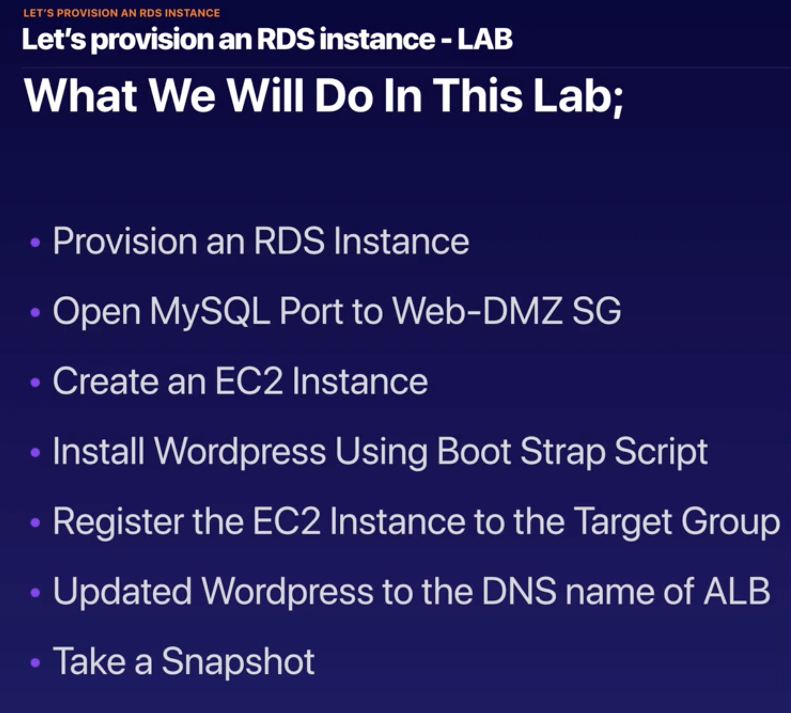
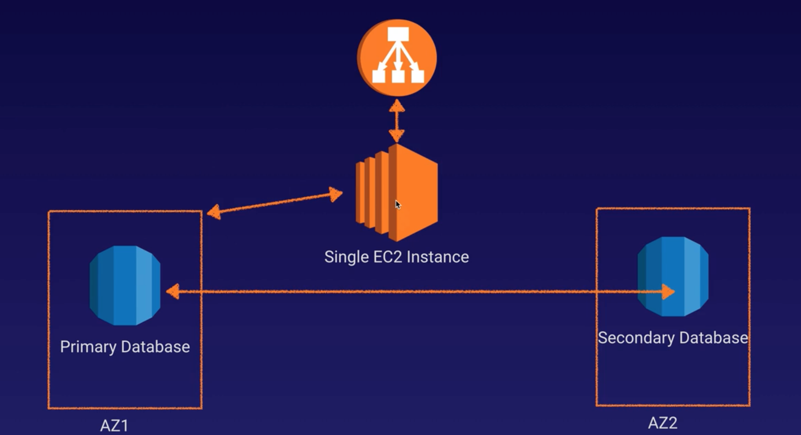

# 1.11 - Autoscaling a Wordpress Site

In this lecture, we look at autoscaling. To do this, we're going to start by provisioning an RDS instance. This brings together much of the work we've seen so far with regards to EC2, Load Balancing and Databases. We'll then set up autoscaling on our instance

## Provisioning the Instance

The key steps we took in provisioning our instance are recorded in the image below:

At the end of this process, we're left with an architecture that looks like the image below. 

Note that to have the multi-AZ DB instances shown, you'll need to enable an option when provisioning your RDS zone that takes you out of the free tier. So feel free to leave this if you'd rather save the money.

One of the key things to take away from the image below is that it still has a single point of failure: the single EC2 instance. That's where autoscaling comes in.

## Autoscaling

To set up autoscaling, we're going to go ahead and terminate our instance and use the AMI (Amazon Machine Image, i.e. the snapshot we created) to create an autoscaling group. That will create two instances across two AZs, remove our single point of failure, and give us a fault-tolerant website.

There are two key parts to setting up autoscaling:
1. Setting up the **launch configuration**, which determines the configuration of the launched EC2 instances.
2. Creating an **autoscaling group**

Setting up the configuration itself is similar to setting up a new EC2 instance. The only key difference is that we'll use our snapshot as our image rather than one of Amazon's defaults.

Setting up the autoscaling group is a little more involved. But in principle, attach the launch configuration, specify the availability zones it'll setup the instances in, put it behind the load balancer we've set up, and create a role for it in IAM.

Once this is all set up, you should have multiple instances up and running to back up your Wordpress site. One of the perks of this is that if you terminate any of your instances (e.g. with a ChaosMonkey type rig) the system should automatically take it out of service and replace it with a new instance, just like that.

Make sure to take all this (i.e. the Auto Scaling Group, the RDS instance and the Application Load Balancer) down after you've created it, if you don't want to be billed.