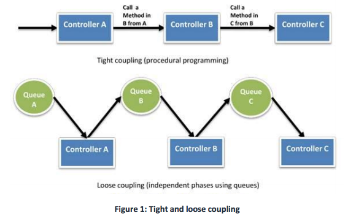

# 1.19 - Architecting For the Cloud - Design Principles (Loose Coupling)

The topline takeaway here is that you should aim to design your applcation as a collection of small, loosly coupled components. That lets you define your system in a way that reduces interdependencies. The heading of this section are all key things to bear in mind when designing your components.

## Well Defined Interfaces

A key tool in designing a system without interdependencies is to only allow your various components to interact with each other through specific, well-defined, technology agnostic interfaces (e.g. RESTful APIs).

This hides technical implementation details so that teams can modify the underlying implementation without affecting other components. As long as you maintain backwards compatability, the deployment of different components becomes uncoupled. This granular design pattern is commonly refered to as a **microservices architecture**.

**Amazon API Gateway** is a fully managed service that developers can use to handle hundreds of thousands of concurrent API calls, including traffic management, autorization, access control, monitoring and API version management

## Service Discovery

In a system where applications are deployed a set of smaller, independent services, that can each individually scale to meet demand, its imperative that there is a way to call each service, without worrying about how many instances of it are up or what they're specific IP addresses are. Doing so is crucial in allowing your infrastructure to scale on a granular level.

The easiest way to implement service discovery is by using an Elastic Load Balancing (ELB). Because each load balancer has its own hostname, you have a stable endpoint to hit your service through. In addition, by using DNS and private Amazon Route 53 zones, you can abstract and mock your particular load balancer's endpoint at any time.

Another option is to use service registration and discovery. Because service discovery becomes the glue between components, it is vital that it remains highly available and reliable. If load balancing is not used, it should also allow options for health checks.

## Asynchronous Integration

Another form of loose coupling between services is asyncronous integration. In essence, this amount to managing request between services by letting the requesting service put them in a queue, and letting the consuming service pull those request from a queue and act on them on-demand.

For this to be feasible, its necessary that the component generating the event does not need an immediate response, and where an acknowledgement of registration is sufficient.

This approach decouples the event generator and consumer, and introduces additional resilience into your system. So, for example, if the component which consumes the requests goes down, other generating components can continue to queue events, which will be serviced when the consuming component comes back up. It also allows you to find the right trade-off between cost and processing lag for the individual parts of your system. Finally, not forcing the user to wait for slow API operations can also improve the end-user experience.

Examples of asynchronous integration include:
* A front-end application inserting jobs into an Amazon SQS queue service. The backend can retrieve and process those jobs at its own pace.
* An API that generates events and pushes them to a Kinesis stream. A backend then processes those events in batches to created data stored in a DB
* Multiple heterogenous systems using AWS Step Functions to communicate the flow of work between them without directly interacting
* Lambda functions can consume events from a wide variety of AWS sources. You don't need to implement a queue in this case, because Lambda takes care of that for you.

## Graceful Failure in Practice

FInally, a way to increase loose coupling is to build applications which can handle the failure of individual components gracefully. Examples include:
* Letting a front-end return cached data if the service it retrieves data from goes down
* Using Route 53 DNS to direct visitors of your website to a backup site when your main site goes down.