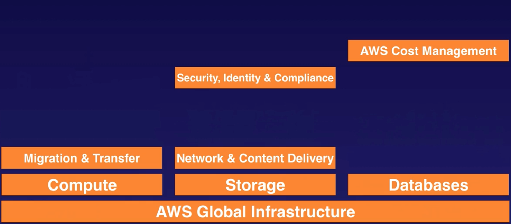
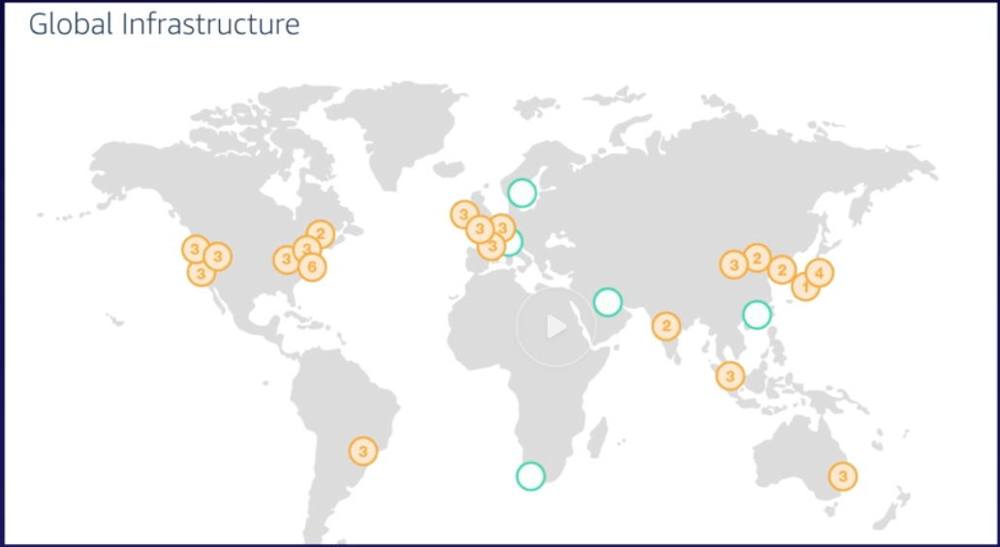
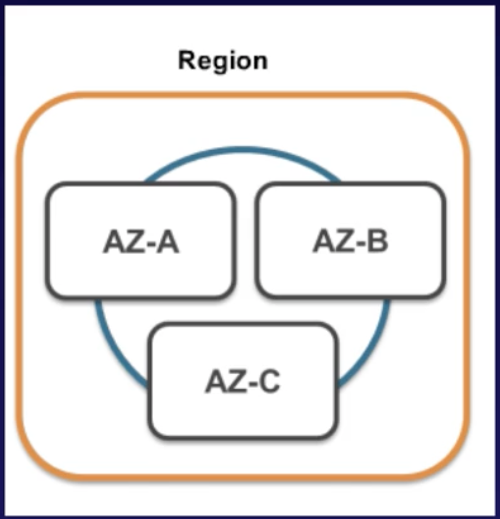

# 1.2 - Around the World with AWS

AWS has grown ludicrously complicated and vast over the last few years. Whereas in 2015, they might have had around 50 services, now, there are well over 90. Again, most of these are not needed for the cloud practitioner exam, or even the professional exams. So going through all of them isn't really feasible or particularly useful.

Luckily, we only need to know a subset. You might remember them from the image we attached int he last note below.

Note that of the services above, two, Migration & Transfer and Network & Content Delivery, have very small parts in the exam in question.

In this lecture, we'll take a very brief, high level look at what we need to know about the AWS Global Architecture for the cloud practitioner exam.

## AWS Global Infrastructure

As of December 2018, there are 19 regions and 57 availability zones in the AWS infrastructure, with more on the way. What the hell are those things?

Well, the easiest way to think of an **availability zone** is as a data center. In actual point of fact, a zone might consist several data centers, but they're close enough together to fall in the same zone.

A **region** is a geographical area. Each region consists of 2 or more Availability Zones.

The reason for the distinction between regions and availability zones is to help ensure that if there's a major environmental disaster (floods, fires etc.) in a geographical part of the world (a region), the computing power is spread out enough that the region won't go down. For this reason, availability zones all have redundant power, networking and capabilility.

Finally, there's also the concept of **edge locations**. Edge locations are endpoints for AWS which which are used for caching content. Typically, these consist of CloudFront, Amazon's Content Delivery Network (CDN)

There are many more edge locations than regions. Currently (as of Dec 2018) there are over 150.

## A Brief Look at Today's Regions

North America has 7 regions. 4 for the US (Northern Virginia, Ohio, Oregon and Northern California), 2 for the Government specifically (US-East and US-West), and one for Canada (Central).

South America only has 1 region, Sao Paulo.

Europe, the Middle East and Africa has 4 (Ireland, London, Frankfurt and Paris) regions.

Finally, Asia Pacific has 8 regions spread across it.

