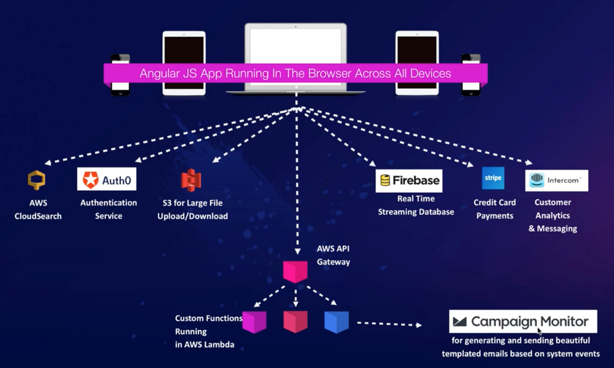

# 1.20 - Architecting For the Cloud - Design Principles (Services not Servers)

Building applications requires developing, managing and operating a wide variety of technological components. In a traditional IT environment, the company has to build and operate everything. With AWS, you have services that offer each of the underlying components individually (e.g. compute, storage, datatbse, analytics etc.)

If your architecture doesn't leverage the breadth of the AWS service collection (e.g. you only use EC2), this likely means you're not making the most of the opportunity cloud computing offers.

## Managed Services

AWS managed services are the building blocks that developers can use to power their applications. Those services cover a wide breadth of needs, and are each individually optimized for their own use cases, so it behooves the developer to use the appropriate services for their application, rather than trying to replicate their functionality manually.

Examples include (but are in no way limited to):
* SQS for operating ans scaling a highly available message cluster
* S3 to store as much static data as you need to
* CloudFront for content delivery
* ELB for load balancing
* DynamoDB for NoSQL databases
* CloudSearch for search workloads
* Simple Email Service (SES) for sending and receing emails

## Serverless Architectures

Serverless is the future. The goal of serverless architectures is to eliminate the need for servers entirely through a combination of having services deal with the situations they're explicitly designed for, and then using stateless functions (like AWS Lambda functions) to execute application logic as and when is necessary.

The advantages of this model of architecture is that you can save costs by not paying for underutilized servers, and also remove the need to provision redundant infrastructure to implement high availability.

For example, by using Amazon's API Gateway and Lambda functions, you can essentially create an infinitely scalabe API. Back that up with some S3 buckets, and you can deliver a complete web application.

As an example, look at the (slightly outdated) diagram of the acloud.guru tech stack below. A fully functional learning platform without a single EC2 instance.

The serverless web application example above is just that, an example; variations on this pattern can be utilized on pretty much any type of solution (mobile and web apps, IoT, data analytics and more). This is very much the direction the industry is moving in.