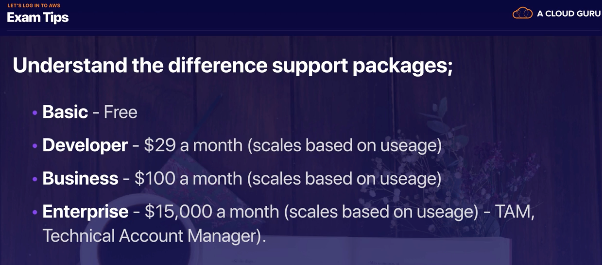

# 1.3 - Support Plans with AWS

There are 4 main tiers of support AWS offer:
1. Basic:
   * Free
   * Customer Service only for account and billing questions
2. Developer:
   * From $29 a month
   * Primary contact for technical support, 12-24 hour response time
3. Business:
   * From $100 a month
   * 24/7 support by phone and chat
   * 1-hour response time to urgent support cases
   * Full access to AWS Trusted Advisor
   * Access to AWS Support API
2. Enterprise:
   * From $15,000 a month
   * All feature of business plan
   * Assigned Technical Account Manager(TAM) who provides guidance
   * Support Concierge for billing and account analysis
   * Access to Infrastructure Event Management to support major company events
   * 15 minute response to critical support cases with prioritized case handling.
