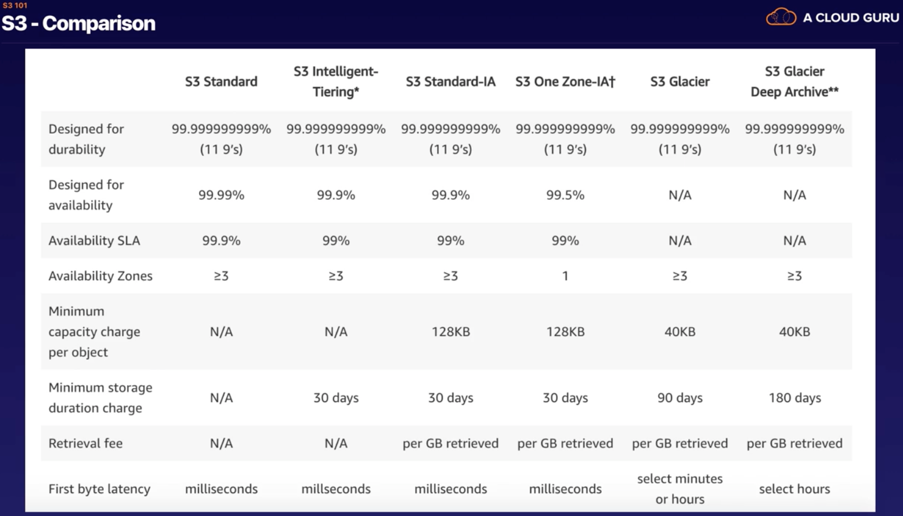
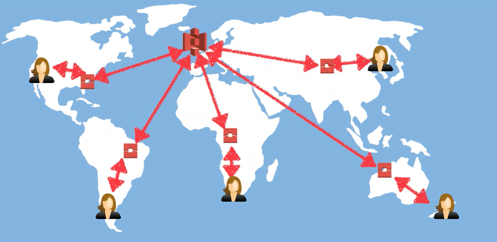
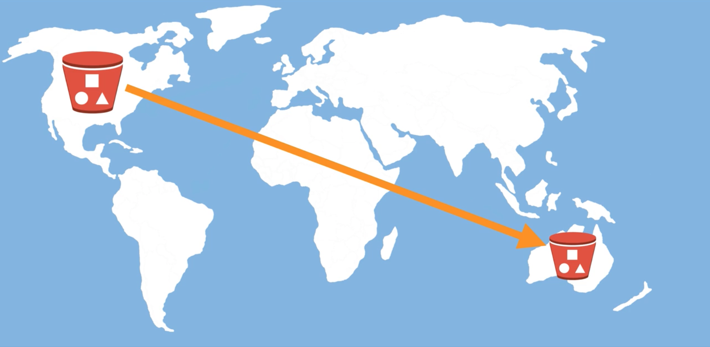

# 1.5 - Intro to S3 (Simple Storage Service)

S3, which stands for Simple Storage Service, is one of Amazon's oldest and most used services. Expect to see it in every exam you take. What is it? Well, according to Amazon:

> *S3 provides developers and IT teams with secure, durable, highly-scalable object storage. Amazon S3 is easy to use, with a simple web services interface to store and retriece any amount of data from anywhere on the web.*
> 

In normal people (well, normal dev) speak, S3 provides object storage. It can store flat files of any variety (think videos, images, documents etc.), and

> **Aside** - Object based storage is the opposite of Block based storage. While object based storage is used for items which do not change in size, block based is used for files with dynamic sizes. Examples include operating systems and databases.
> In short, don't install operating systems or anything like them in an S3 bucket.

## S3 Basics

* S3 is **object-based** - i.e. it allows you to store files
* Files can range from 0 Bytes to 5 TB
* There is unlimited storage
* Files are stored in Buckets
* S3 is a universal namespace. In other words, names must be unique globally.
  * Actually, S3 is one of only a few services (IAM and Route53 are similar) which do not require you to specify a region when you use them.
  * However, while you get a global view of your S3 buckets when using them, individual buckets are created in a specific region.
* URLs are of the format: https://s3-eu-west-1.amazonaws.com/bucket-name
* When you upload a file to successfully S3 you'll receive a 200 status code

## S3 Objects

As we've already iterated a dozen times (it is important), S3 is object based. Think of objects as plain old regular files. Objects consist of the following:
* **Key** - The name of the object
* **Value** - The data that makes up the object.
* **Version ID** - Important for versioning.
* **Metadata** - Data about the data you're storing
* Subresources:
  * Access Control Lists
  * Torrent

## Data Consistency and S3

How S3 maintains data consistency is an important exam topic. The key points to remember are that:
* There is Read after Write consistency for PUTS of new objects
* There is Eventual Consistency for overwrite PUTS and DELETES (it can take some time for them to propogate)

In essence, if you write a new object to S3, it is immediately available to anyone who might want to read it. If you delete or update an existing object, then it will take a little time before all your users will receive a consistent response for querying the object. In the interim period, it is possible that they will receive the older version of the object.

## S3 - Guarantees

Amazon makes a number of guarantees surrounding the performance of S3. They are that:

* S3 is built for 99.99% availability.
* Amazon only guarantees 99.9% availability however
* Amazon guarantees 99.999999999% durability for S3 information. In the industry, this is called the 11 9s. (Durability is defined as "the probability that the object will remain intact and accessible after a period of one year")

## S3 - Features

S3 provides the following features:

* Tiered storage
* Lifecycle Management (which lets us manage the tier of a particular file over a period of time)
* Versioning
* Encryption
* The ability to secure your data using both **Access Control Lists** (which operate on an individual file basis) and **Bucket Policies** (which operate on the whole bucket).

## S3 Storage Classes (Tiers)

There are currently 6 different storage classes available for files on S3. New ones were added as recently as Re:Invent 2018, so these are being continuously updated.

Note that you can change the individual tier of an object on the fly.

* **S3 Standard** - 99.99% availability, 11 9s durability, and stored redundantly across multiple devices in multiple facilities. This storage class is designed to sustain the loss of two facilities concurrently.
* **S3 - IA** - (Infrequently Accessed) Fir data that is accessed less often, but requires rapid access when it is needed. This has a lower fee than S3, but you are charged a retrieval fee.
* **S3 One Zone - 1A** - For when you want a lower cost option for infrequently accessed data, and do not require multiple availability zone data resilience
* **S3 - Intelligent Tiering** - Designed to optimize the cost by automatically moving data to the most cost-effective access tier without a performance impact or operational overhead.
* **S3 Glacier** - S3 Glacier is a secure, durable, low-cost storage class for data archiving. You can reliably store any amount of data at costs competitive with or lower than on prem solutions. Retrieval times are configurable from minutes to hours.
* **S3 Glacier Deep Archive** - Amazon S3's lowest cost storage class, where a retrieval of 12 hours is acceptable.

## S3 Charges

S3 charges you in a number of ways, a few of which are self explanatory, and a few of which necessitate a bit more detail. They are:

* Storage - You're charged based on the amount of data stored
* Requests - You're charged based on the number and types of requests made
* Storage Management Pricing - Extra features like inventory, analytics and object tagging are charged individually
* Data Transfer Pricing - Transferring data "in" and "out" of Amazon S3 over the internet carries a fee
* Transfer Acceleration
* Cross Region Replication Pricing

Transfer Acceleration and Cross Region Replication Pricing need slightly deeper explanations

### Transfer Replication

Amazon's own blurb is probably the best description of Transfer Replication, even taking into account the marketing speak:

> Amazon S3 Transfer Acceleration enables fast, easy and secure transfers of files over long distances between your end users and an S3 bucket.
> Transfer Acceleration takes advantage of Amazon CloudFront's globally distributed edge locations. As the data arrives at an edge location, data is routed to Amazon S3 over an optimized network path.

Let's illustrate this with an example. Say you have a bunch of globally distributed users who want to upload a file to your S3 bucket, which is hosted in London. With Transfer Acceleration on, what those users will actually do is upload their files to the edge location nearest to them. Once its there, Amazon will use its own, internal, superfast network to transfer the file to your S3 bucket.

### Cross Region Replication

This one is actually pretty simple. Let's say you have a bucket in the US. If you have cross region replication enabled, all that happens when you uplaod a file to your primary bucket in the US is that it is automatically replicated to another, secondary bucket in another region (say, the Sidney region). 

Obviously, this provides you with some catastrophic disaster insurance.

