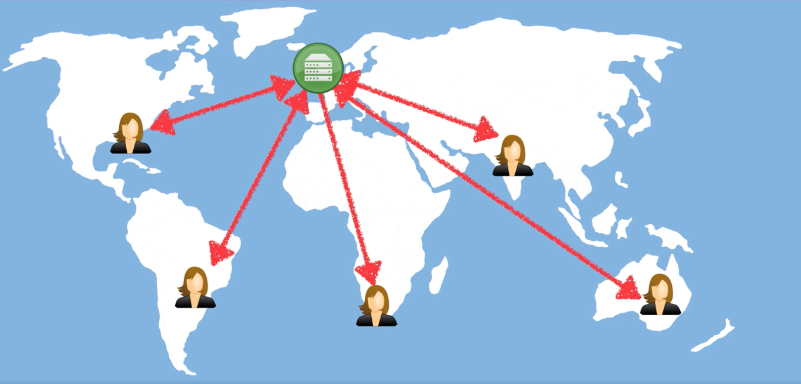
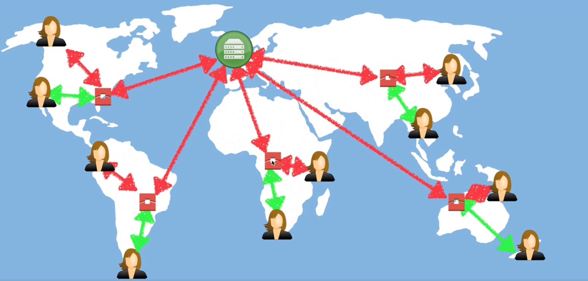

# 1.6 - Intro To CloudFront

So, what is CloudFront? Well, CloudFront is Amazon's content delivery network (commonly known as a CDN).

## What is a CDN?

A CDN is a system of distributed servers (network) that deliver webpages and other web content to a user based on that user's geographic location, the origin of the webpage, and a content delivery server.

To understand the use case of a CDN, consider a server in London which has a video file stored on it. That video file is a couple of gigs. If users from all over the world want to watch that video, the only way they can without a CDN is to make a link to that server directly and download the video. Depending on where they are and their connection speeds, this whole process can take quite a long time. CDNs help to speed this process up.

### Key Terminology

There are 3 key pieces of terminology we'll need to explore to understand CDNs.

* **Edge Locations** - This is the location where the content will be cached. They are seperate to AWS Region/AZ
* **Origin** - This is the origin of all the files that the CDN will distribute. It can be an S3 bucket, an EC2 instance, an Elastic Load Balancer, or Route53
* **Distribution** - This is the name given to the CDN, which consists of a collection of Edge Locations.

As a side note, edge locations are not just read-only. You can write to the as well (i.e. put on object on them). Tools like S3's Transfer Acceleration are an example of that.

### Back to The Example

Let's look at our example. We still have our S3 bucket based in London, and our users based all around the world. Now however, when the users try to get the file, their requests will first go to the nearest edge location.

The first time the users make that query, the edge location will not have a copy of it, so it will query the origin (our London DB) and download the file from it. Because this happens on an internal Amazon network, it's much faster. The edge location can then serve it to the user.

The second time that file is requested from the edge location, whether by that user or by a different user. There will already be a cached copy of it on the edge location, so it can just serve up its cached copy.

The file is cached at the edge location for a given period of time, which is called the file's TTL, or Time To Live. This is always measured in seconds, and is usually set to about 48 hours.

If you want, you can clear your cached objects, but you will be charged for that.

## CloudFront Distribution Types

Amazon CloudFront can be used to deliver your entire website, including dynamic, static, streaming and interactive content using a global network of edge locations. Requests for your content are automatically routed to the nearest edge location, so content is delivered with the best possible performance.

There are two kinds of distributions. They are:
* **Web Distribution** - Typically used for websites. We use this one in a lab.
* **RTMP** - Use for media streaming. Is used a lot less nowadays than it once was. RTMP is short for Adobe's Real-Time Messaging Protocol.

