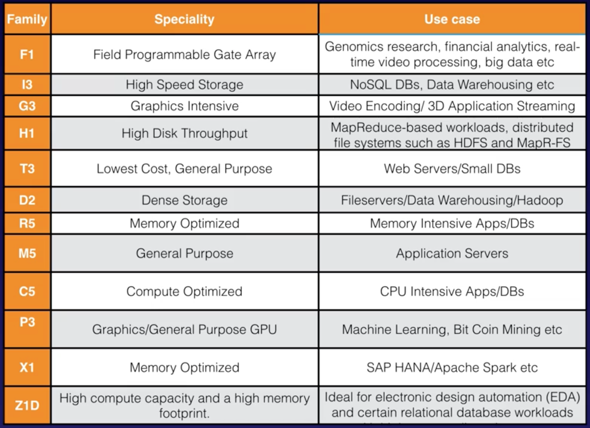

# 1.7 - Intro To EC2 (Elastic Compute Cloud)

EC2 is one of the oldest services in AWS. It features heavily in all the various AWS certification exams.

## What is EC2?

Amazon Elastic Compute Cloud (EC2 from here on out) is a just a virtual server (or servers) in the cloud.

Amazon EC2 reduces the time required to obtain and boot new server instances to minutes, allowing you to quickly scale capacity, both up and down, as your computing requirements change. This is a vast improvement on the weeks and months long deployments and 3-5 year contracts that were necessary when you could only rent out physical servers, rather than have a set in the cloud.

## Pricing Models

EC2 has a number of pricing models. They are:

1. **On Demand** - Allow you to pay a fixed rate by the hour (or by the second) with no commitment. (We'll use these in the course)
2. **Reserved** - Provides you with a capacity reservation, and offer a significant discount on the hourly charge rate for an instance. Contract Terms are either 1 or 3 years.
3. **Spot** - Enables you to bid whatever price you want for instance capacity, providing for even greater savings if your applications have flexible start and end times.
4. **Dedicated Hosts** - Physical EC2 servers dedicated for your use. Dedicated Hosts can help you reduce costs by allowing you to use your existing server-bound software licenses.

### Use Cases

Each of these 4 options has a slightly different use case.

**On Demand** pricing is useful for users that want the low cost and flexibility of Amazon EC2 without any up-front payment or long-term commitment. It's also well suited for applications with short-term, spiky or unpredictable workloads that cannot be interrupted, and for applications being developed or tested on Amazon EC2 for the first time.

**Reserved** pricing is useful for applications that have a steady state or predictable usage, and applications that require a reserved capacity. Users are able to make upfront payments to reduce their total computing costs even further.

Reserved actually has several pricing types within it. They are

1. **Standard Reserved Instances** - These offer up to 75% off on demand instances. The more you pay up front, and the longer the contract, the greater the discount.
2. **Convertible Reserved Instances** - One of the things we'll learn in this course is that there are numerous types of EC2 instance, each with their own strengths and weaknesses. Convertible Reserved Instances offer up to 54% off on demand capability to change the attributes of the RI as long as the exchange results in the creation of reserved instances of equal of greater value. More detail on this isn't necessary til the Professional certification exams.
3. **Scheduled Reserved Instances** - These are available to launch within the time windows you reserve. This option allows you to match your capacity reservation with a predictable recurring schedule that only requires a fraction of a day, a week, or a month.

**Spot** pricing is useful for applications that have flexible start and end times, and for applications that are only feasible at very low compute prices. There are a variety of studies on the AWS website that explore genomics and engineering companies that need a lot of computing power, who only run their servers late at night to keep costs down.

Spot pricing is also useful for users with urgent computing needs for large amounts of additional capacity.

One important thing to know for the exam is that if you have a spot instance, you won't be charged for a partial hour of usage if Amazon EC2 terminates your instance. However, if you terminate it yourself, then you'll be charged for any hour in which the instance ran.

**Dedicated Hosts** are useful when you encounter regulatory requirements that may not support multi-tenant (i.e. many users use the same server) virtualization. They're also great for licensing that doesn't support multi-tenancy or cloud deployents.

Dedicated hosts can be purchased On-Demand (hourly), as well as a reservation for up to 70% off the On-Demand price.

## EC2 Instance Types

As mentioned earlier, there are a variety of EC2 Instance Types. Luckily you don't need to know the specifics of different instance types until you get to the Sys Ops Administrator exam. The chart below briefly summarises the instance types specialities and use cases:

Even though its not important to know these for the earlier exams, they are useful to know in real life. Below, we'll show a little mnemonic that summarises them, FIGHT DR MC PXZ (fight doctor mc Pixie):

* **F** is for FPGA
* **I** is for IOPS (stands for input output per second)
* **G** is for Graphics
* **H** is for High Disk Throughput
* **T** is for cheap general purpose (think T2 micro)
* **D** is for Density
* **R** is for RAM
* **M** is the Main choice for general purpose apps
* **C** is for Compute
* **P** is for graphics (Think Pics)
* **X** is for Extreme Memory
* **Z** is for Extreme Memory any CPU

## Amazon EBS

Another important thing to know about EBS. What is Amazon EBS? Well...

> Amazon EBS allows you to create storage volumes and attach them to Amazon EC2 instances. Once attached, you can create a file system on top of these volumes, run a database, or use them in any other way you would use a block device. Amazon EBS volumes are places in a specific Availability Zone, where they are automatically replicated to protect you from the failure of a single component.
> 

EBS comes in 2 types, SSD and Magnetic, which themselves have subtypes:
* **SSD** - Solid State Drives come in two varieties:
  * **General Purpose SSD (GP2)** - balances price and performance for a wide variety of workloads.
  * **Provisioned IOPS SSD (IO1)** - Highest performance SSD volume for mission-critical low-latency or high-throughput workloads.
* **Magnetic** comes in 3 different flavors:
  * **Throughput Optimized HDD (ST1)** - Low cost HDD volume designed for frequently accessed, throughput-intensive workloads
  * **Cold HDD (SC1)** - Lowest cost HDD volume designed for less frequently accessed workloads (File Servers)
  * **Magnetic** - Previous generation. Don't need to know this for Cloud Practitioner