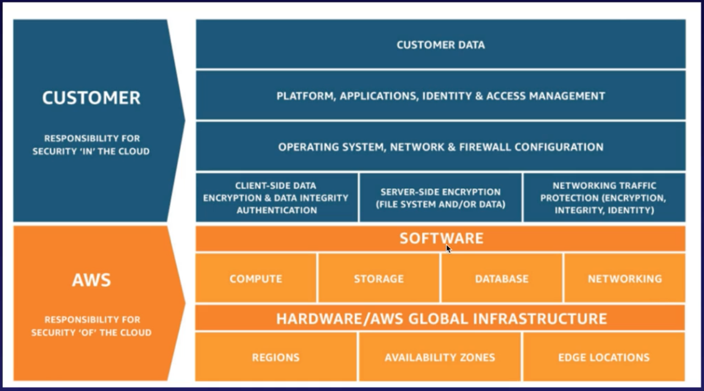

# 3.1 - AWS Compliance and the Shared Responsibility Model

AWS have a vast number of compliance certificates and programs to which they adhere to. The full list is available at [Compliance Programs - Amazon Web Services (AWS)](https://aws.amazon.com/compliance/programs/). When you're being audited, you can go through and get copies of these reports that you can provide to your auditors which ensure that AWS is compliant with the necessary checks.

## Shared Reponsibility Model

Note, for more details visit this page: [Shared Responsibility Model - Amazon Web Services (AWS)](https://aws.amazon.com/compliance/shared-responsibility-model/). It is heartily recommended that you read this page before the exam.

The important thing to remember is that AWS works on a **shared responsibility model** for compliance. In essence:
* AWS manages the security **of** the cloud.
* Security **in** the cloud is the responsibility of the customer. This includes the security you choose to implement to protect your content, applications, systems and networks. This is just the same as it would be for an on-site data center.

The diagram below ilustrates in more detail how this division of responsibilities plays out.

